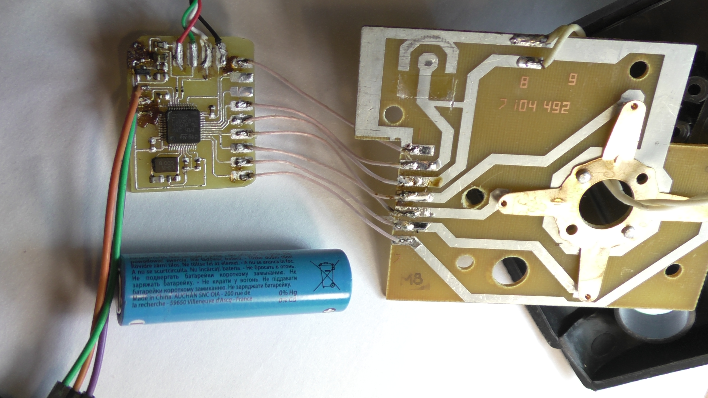
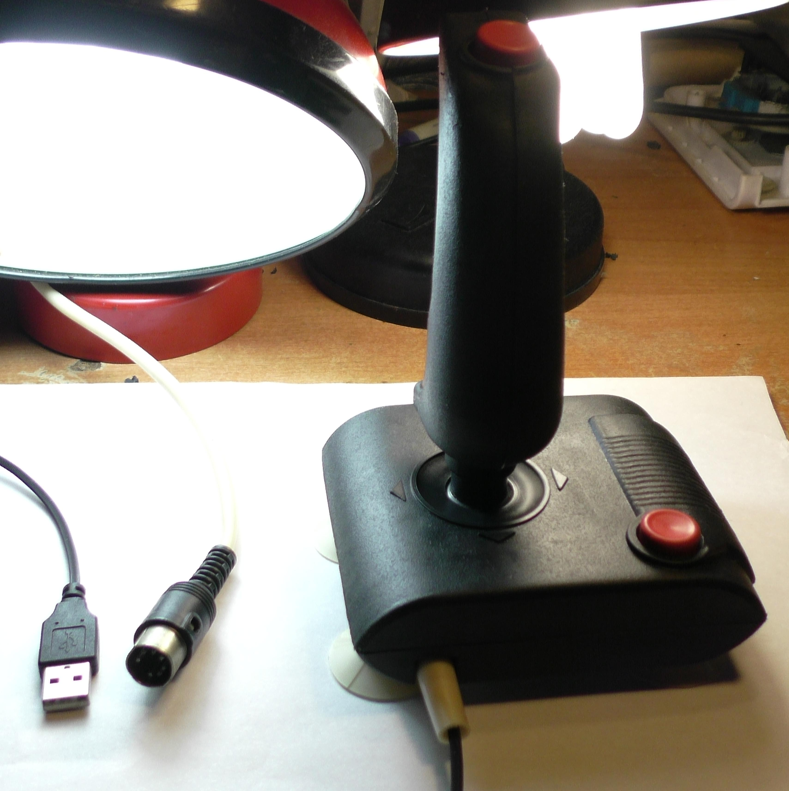
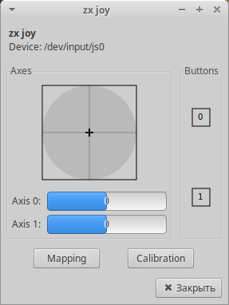

# usb_device3
USB HID gamepad.
STM32 based USB adapter for ZX spectrum joystick. You may connect gamepad
with d-pad and two buttons to PC using USB.
Tested and working.

Project structure:\
/result - here is all usefull files to try this project (firmware binary, schematic and pcb template)\
/lib - basic code directory\
/lib/regs - stm32 MCU registers (lowest micriocontroller API level)\
/lib/STM32F103_CMSIS/ - MCU specific part of CMSIS\
/lib/CMSIS_5 - ARM CMSIS abstraction level directly from arm, as a submodule\
fpjat - build and upload script (for xubuntu, needs gcc arm toolchain and st-link, see pdf)\
/doc - project documentation in tex\
/datasheet - all related documentation (datasheets, standards)\
/sch - KiCAD schematic project
More information about device in blog:
https://dltecc.blogspot.com/2021/10/continue-on-your-own-risk-cmsis-v5.html
https://dltecc.blogspot.com/2021/09/report-descriptor-example.html
https://dltecc.blogspot.com/2021/11/usb-hid-driver-for-stm32.html